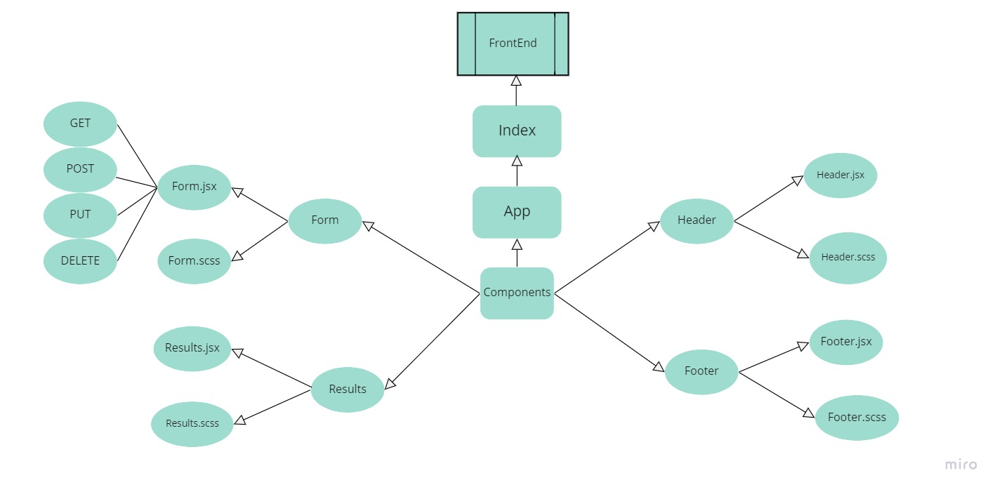

# RESTy application

## an API testing application, flexible to run on any browser, allows the user to easily interact  with APIs in a familiar interface

***
### [SandBox](https://codesandbox.io/s/resty-nm6h4) 

### [Pulls](https://github.com/amr88nzzal/resty/pull/2)

***
## Setup:
  * To start the app: `npm start`
  * To use Sacc for styling: `npm i node-sass`

***

## UML Diagram

